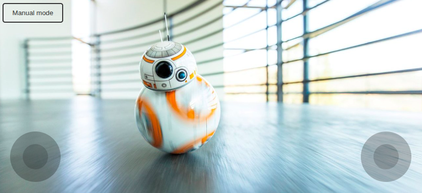
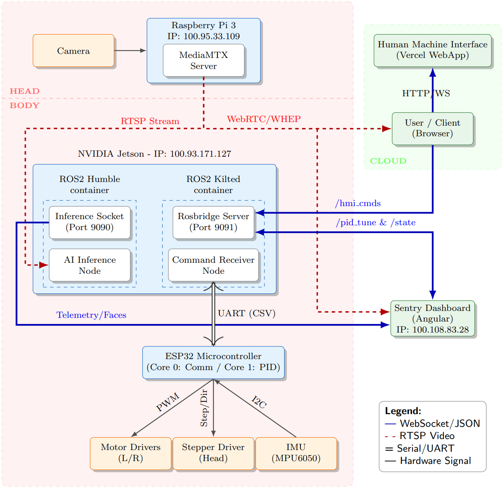

# DIY BB-8 Project


A repository documenting the build of a personal, remote-controlled BB-8 droid inspired by _Star Wars_. This project uses common hobbyist electronics and a mix of 3D-printed and custom-made parts to recreate the iconic droid's movement.

---

## 🌟 Features

- **Spherical Movement:** Rolls in any direction using a "hamster-style" internal drive mechanism.
- **Magnetic Head:** The head "floats" on top of the body, held in place by magnets, and can look around.
- **Remote Control:** Controlled via a custom smartphone app or web interface using Bluetooth/Wi-Fi.
- **Face Detection:** The heads camera streams a video to the body which does Inference on the Edge.
- **Sentry Dashboad:** Shows robot state and detected faces in real-time.

---

## 🛠️ Materials & Components

### Electronics

- **Main controller:** ESP32
- **Main computer:** NVIDIA Jetson
- **Head computer:** Raspberry Pi 3
- **DC motors:** 2x 12V gearmotor with encoders, 122RPM, 90:1, 38Kg.cm
- **DC motor drivers:** 2x H-bridge BTS7960 5.5V to 27V 43A PWM
- **Stepper motor:** NEMA 17, 4.8 V
- **14.8V LiPo battery** 2400 mAh, powers the drive system
- **11.1V LiPo battery** 2400 mAh, powers the Jetson, stepper motor and the ESP32 with all connected sensors.
- **12V step-down converter:** Converts the 14.8V from battery to 12V motor E-Motor
- **5V step-down converter:** Converts the 11.1V for low-power consumers
- **IMU sensor/gyroscopic sensor:** Measures the platform inclination
- **Rocker switch** Powers on-off the entire system
- **Misc:** wires, switches, cable lugs, resistors, capacitors

### Hardware & Body
Link to the CAD-files: https://tumde-my.sharepoint.com/:u:/g/personal/martin_waxenberger_tum_de/IQCvh5IetDzzRL6QHhY5nwgcAf_V6iJTSffVneadlo5a15s?e=HcrNPn

If not accessible contact @martinwaxenberger

The Robot is made up of a head and a sherical body. The build is structured in the following way:

**BB-8 Robot Main Assembly Parts (details can be extracted from the CAD)**
* **Head**
  * **Head Shell**
    * head dome
    * head lower shell
    * antenna_big
    * antenna_small
    * lens
    * holo
  * **Head Inner**
* **Body**
  * **Upper Hemisphere**
    * top middle half circle
    * hole for button pentagon
    * regular pentagon connector
    * top and bottom half disc
    * middle pentagons
    * new bb8 button cap w twist
    * twist cap
  * **Lower Hemisphere**
    * regular pentagon connector
    * top and bottom half disc
    * middle pentagons
    * screw connector v6
    * bottom middle half circle
    * Parallel pins (Folder)
  * **Inner Setup**
    * Wooden_plate
    * Reifen (Wheels)
    * Stamped_aluminum_L_Bracket
    * body_servo_magnetholder
    * body_magnetholder_v2
    * DC_Motor_DFRobot_38kgcm
    * Jetson-housing_dummy
    * Magnet_23x4_v1
    * Motor_protector_v1
    * Switch_mount
    * Dummy_Stepdown_12V
    * Dummy_Motordriver_H
    * Motordriver_mount_v1
    * Stepdown_12_mount_v1
    * Stepper_adapter_v1
    * mounting_structure_v1
    * Battery_14-4_dummy
    * Battery_11-1_mount_v1
    * Switch
    * din-trail_v1 (for jetson housing)
    * Stepper_driver_mount_v1
    * IMU_Dummy
    * ESP32-body-dummy
    * Scheiben (Folder - Washers)
    * Zylinderkopfschrauben (Folder - Cylinder Head Screws)
    * Holzschrauben (Folder - Wood Screws)
    * Magnet fixation (Folder)
      * iso_7046-2-m4x25-8_8-h
      * mutter_iso_4032-m4-10
      * Magnet_screwadapter_M4_v1 
    * Bearing_holder_smaller_v1
    * Kugelrolle_Alternativteil_groß (Ball Transfer Unit)
    * Battery_14-4_mount_v1
    * Capa_pcb
    * Stepdown_5_10
    * Breakout_PCB
    * AdjustableWeight (housing)
    * AdjustableWeight_cap
    * weight
    * Adapter_SDC
    * Stepper Motor 28BYJ-48
    * Stepper_mount_v1
    * Antenna (not included)
    * Nvidia Jetson Nano (not included)

---

## 🏗️ Build Process (Overview)

The design of some of the robot parts -including the shell- were taken from a simple design by [Nachumtwersky on Instructables](https://www.instructables.com/3D-Printed-Robotic-BB8-unfinished-Instructions-Wil/).

1.  **The Body:** The sphere was 3D-printed in sections and assembled by glueing, friction welding, and coating with epoxy resin. We followed the process found on the instructables page exactly. However, we would strongly recommend to remodel the shell single parts to make them fit together better, because the blueprint ones are highly inaccurate and make the assembly tedious.
2.  **The Body's Base Platform:** A wooden base platform was cut from leftover wood. The dimensions were adapted from the blueprint. The necessary holes for the cable passage and all screws were measured and drilled first. The parts were then printed and fixed onto the platform. Currently, a weight is fixed onto the bottom of the platform with cable ties to ensure low center of mass. A magnet assembly, controlled by a stepper, is mounted on a mast at the top of the body's base platform, just under the sphere's inner "roof."
3.  **The Head:** The head was completely remodeled compared to the blueprint. The central piece made from orange PLA houses three bearings and four magnets, that correspond to the body's magnets. It functions as the base part for the Raspberry and camera mounts aswell as being the part that the head's top and lower shell parts get snapped on. 
4. **Wiring:** The exact wiring is as follows: 
5.  **Assembly:** After finishing the subassemblies (Head (Head_Upper_Shell, Head_inner_platform, Head_lower_Shell), Body_Base_platform, Body_Shell_Upper_hemisphere, Body_Shell_Lower_hemisphere), the Base Platform gets switched on and placed into the lower hemisphere, then the upper hemisphere gets put on the lower hemisphere and fixated with screws to finish the body. The head shell only gets clipped onto the central orange part, which finishes the head. Now it can be put onto the body by finding the magnet locking position.
6.  **Code:** The Code is found in this very repository.

---

## 💻 Code

You can find all the code used in this project in this Repository.

- `/ai_inference/` is based on the [jetson-inference by dusty-nv](https://github.com/dusty-nv/jetson-inference/) and runs the Face detection on the NVIDIA Jetson Nano.
- `/basic_control/` uses PlatfromIO and the Arduino Framework to flash the low level controller code on the ESP32.
- `/HumanMachineInterface/` (HMI) is an Angular webapp which is the user uses to remote control the robot.



- `/ros_control/` starts a Docker container which acts as the central communication node between the ESP32 and the HMI as well as the Sentry Dashboard. 
- `/SentryDashboard/` is an Angular webapp which shows the robot state like platform inclination and motor speeds as well as the detected faces in real-time.

## Communication




# Starting up the system
## Hardware
1. Connect XT60 connectors and check all the connections on both power lines
2. Turn on the green power switch
3. Check the ESP32 breakout board if the power switch is turned on (esp32 receives power from battery)
4. Give one check over all the wire connections
    - Power jack to ESP32 breakout board
    - Power jack to NVIDIA Jetson Nano


## Software
### Terminal 1
1. ssh breakingbytes@100.93.171.127 | password: 
2. cd Documents/BB-8
3. docker-compose up -d
4. docker exec -it ros_control /bin/bash
5. cd root/ros_ws/
6. colcon build
7. source install/setup.bash
8. ros2 launch bb8_cmd_receiver bridge.launch.xml

### Terminal 2 - AI Inference
1. SSH breakingbytes@100.93.171.127 | password: 
2. cd Documents/BB-8
4. docker exec -it ai_inference /bin/bash
5. cd python
6. python3 -m face_service --network=facenet --headless --ws-port=9091 --threshold=0.8 --overlay=none --input-width=360 --input-height=240 --input=rtsp://100.95.33.109:8554/cam --input-codec=h264 --output=webrtc://@:8554/output

### Terminal 3 - Dashboard
1. cd to project repository root
2. cd SentryDashboard\sentry-dashboard
3. ng serve

---

### MediaMTX
---

The MediaMTX server runs on the Raspberry Pi and distributes the Camera stream to all connecting clients.
 
/etc/systemd/system/mediamtx.service
- automatically starts the MediaMTX server in the background on boot
- distribute RTSP video streams to connecting clients

/etc/systemd/system/rtsp-stream.service
- automatically starts an FFmpeg process that captures raw video
- constantly streams it to the local MediaMTX server

get status:
```
systemctl status mediamtx.service
systemctl status rtsp-stream.service
```

Restart
```
sudo systemctl daemon-reload
sudo systemctl restart mediamtx.service
sudo systemctl restart rtsp-stream.service
```


# 📜 License

This project is open-source and available to the public. You are free to view, use, modify, and distribute the source code in accordance with the terms of the [MIT License](LICENSE).
_Disclaimer: This is a fan-made project. Star Wars and BB-8 are trademarks of Lucasfilm Ltd. and Disney._
